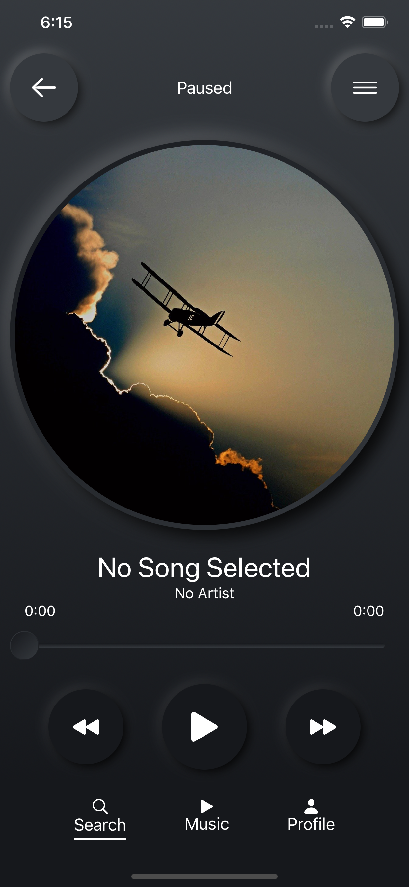
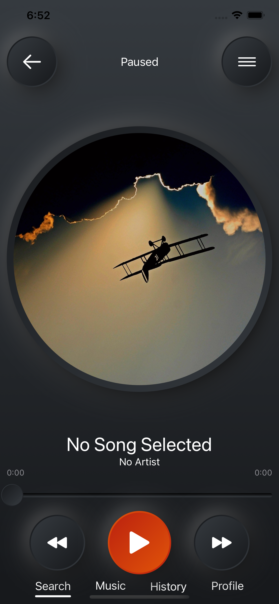
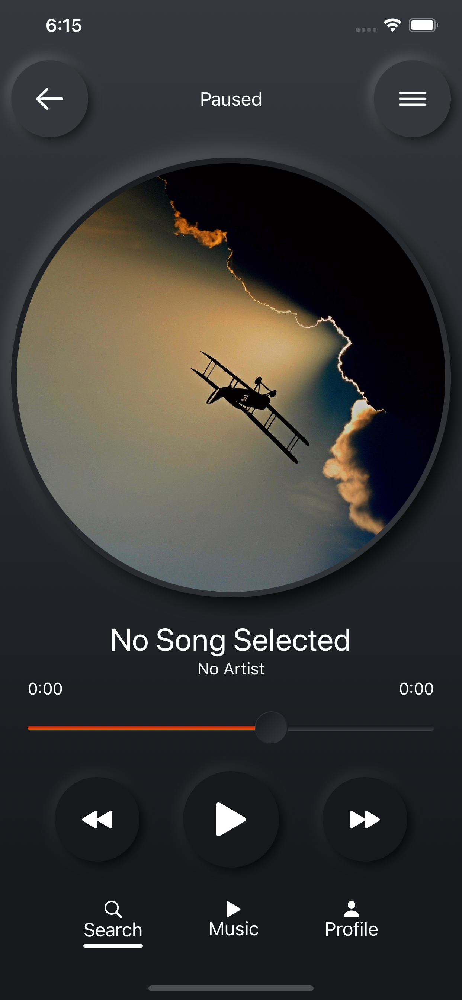

<a href="#"></a>

# NeoMusic - SwiftUI

NeoMusic is an iOS music player app designed to connect many music streaming services into one single app. Taking design queues from neomorphism, buttons and other views have the appearance of popping off the screen.


[![GitHub Issues][issues-image]][issues-url]
[![Dependencies][dependency-image]][wiki-url]
[![Swift Version][swift-image]][swift-url]
[![License][license-image]][license-url]
[![GitHub Pull Requests][pr-image]][pr-url]

<!-- [![Download-iOS][appstore-image]][appstore-url] -->

<!-- Project Images -->

<a href="#"></a>
<a href="#"></a>
<a href="#"></a>

<!-- App in Use Gifs

**App in use:**

  -->

---

## Installation

1. ~~This project can be found on [the App Store][appstore-url].~~

2. Become a beta tester and [download the most recent beta][testflight-url] on TestFlight.

3. Instructions to download/fork and clone and get project running

- Step 1: 
```shell
$ git clone https://github.com/mazjap/NeoMusic-SwiftUI.git
```
- Step 2: 
```shell
$ open NeoMusic-SwiftUI/NeoMusic-SwiftUI/NeoMusic-SwiftUI.xcodeproj
```
- Step 3: 

Connect device or select simulator from drop down and run project

---

## Features

- [x] Apple Music support
- [x] Spinnable artwork
- [x] iOS 14 Widget
- [x] Music searching/filtering (Partial support)
- [ ] Toggleable music player view
- [ ] Spotify support

---

## Documentation

Please refer to the [wiki][wiki-url] for technical details on the project.

---

## Contributing

1. :fork_and_knife: Fork this repo!

2. :dancers: Clone your newly forked repo to your local machine using:
```shell
$ git clone https://github.com/mazjap/NeoMusic-SwiftUI
```
3. :computer: Add some code

4. :leftwards_arrow_with_hook: [Create a new pull request](https://github.com/mazjap/NeoMusic-SwiftUI/compare/) and fill in relevant info.

---

## Contributors

| [Jordan Christensen][website-url] |
| :---: |
| [](https://github.com/mazjap) |
| [ ](https://github.com/mazjap) |
| [ ](https://www.linkedin.com/in/jordan-a-christensen/) |

---

## Attribution

- This README was adapted from [fvcproductions](https://github.com/fvcproductions/)'s [sampleREADME](https://gist.github.com/fvcproductions/1bfc2d4aecb01a834b46).md.
- The pull request template was adapted from [this PULL_REQUEST_TEMPLATE](https://github.com/embeddedartistry/templates/blob/master/oss_docs/PULL_REQUEST_TEMPLATE.md).md

---

## License

This project is licensed under the MIT License

- **[MIT license][license-url]**

<!-- Badge Images -->
[issues-image]: https://img.shields.io/github/issues/mazjap/NeoMusic-SwiftUI "Issues"
[dependency-image]: https://img.shields.io/badge/Dependancies-0-black "Dependencies"
[license-image]: https://img.shields.io/badge/License-MIT-blue "License"
[appstore-image]: https://img.shields.io/badge/-Download%20on%20the%20App%20Store-gray?logo=apple&color=cfdfef "Download on the App Store"
[pr-image]: https://img.shields.io/github/issues-pr/mazjap/NeoMusic-SwiftUI "Pull Requests"

[objc-image]: https://img.shields.io/badge/objc-2.0-blue "Objective-C"
[swift-image]: https://img.shields.io/badge/Swift-5.2-green "Swift"

<!-- URL's -->
[no-link]: #
[issues-url]: ../../issues
[swift-url]: https://swift.org/
[objc-url]: https://developer.apple.com/library/archive/documentation/Cocoa/Conceptual/ProgrammingWithObjectiveC/Introduction/Introduction.html
[license-url]: LICENSE
[appstore-url]: #
[pr-url]: ../../pulls
[wiki-url]: ../../wiki
[website-url]: https://jordan-christensen.com
[testflight-url]: #
